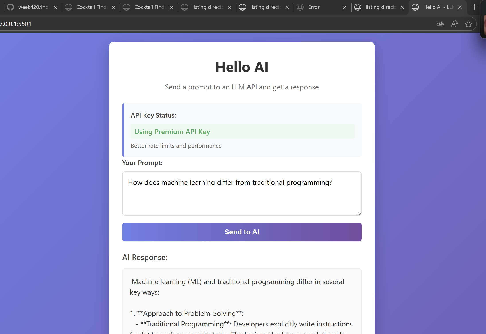

# Hello AI - LLM API Demo

A minimal web application that sends prompts to an LLM API and displays responses using OpenRouter's AI models.

 
 
 
 

## 🚀 Live Demo

[Try the Live Demo Here](https://your-demo-link.com) *[Note: Add your actual demo link here]*

## 📁 Project Structure

```
hello-ai-demo/
├── index.html                 # Main application file
├── config.js                  # API configuration (gitignored)
├── config.example.js          # Example configuration template
├── styles/
│   └── main.css              # All CSS styles
├── scripts/
│   ├── api.js                # API communication module
│   └── app.js                # Application logic
├── .gitignore                # Git ignore rules
└── README.md                 # This file
```

## ⚡ Quick Start

### Method 1: Simple Setup (Free Tier)
1. Download all files to a folder
2. Open `index.html` in your web browser
3. Start chatting with the AI using the free tier!

### Method 2: With API Key (Recommended)
1. Clone or download the project files
2. Rename `config.example.js` to `config.js`
3. Get your free API key from [OpenRouter](https://openrouter.ai/keys)
4. Edit `config.js` and replace `'free'` with your API key:
   ```javascript
   OPENROUTER_API_KEY: 'sk-or-v1-your-actual-key-here'
   ```
5. Open `index.html` in your browser

## 🔧 Configuration

### API Key Setup
1. Visit [OpenRouter Keys Page](https://openrouter.ai/keys)
2. Create a free account if needed
3. Generate a new API key
4. Copy the key (starts with `sk-or-v1-`)
5. Paste it in `config.js`

### Customizing Models
Edit `config.js` to use different models:
```javascript
API_SETTINGS: {
    model: 'mistralai/mistral-7b-instruct:free', // Default free model
    // Other options:
    // 'google/gemini-pro:free'
    // 'meta-llama/llama-2-13b-chat:free'
    // 'huggingfaceh4/zephyr-7b-beta:free'
}
```

## 🎯 Usage

1. **Enter your prompt** in the text area
2. **Click "Send to AI"** or press **Ctrl+Enter**
3. **Wait for the response** - loading indicator will show progress
4. **Read the AI's response** in the output area

### Sample Prompts to Try:
- "Explain quantum computing in simple terms"
- "Write a haiku about artificial intelligence"
- "What are the ethical implications of AI?"
- "Create a recipe for chocolate chip cookies"

## 🔒 Security Notes

- API keys are stored locally in `config.js`
- **Never commit `config.js` to version control**
- Free tier has rate limits (consider upgrading for heavy use)
- All communication uses HTTPS

## 🛠️ Technical Details

### Built With
- **HTML5** - Semantic markup
- **CSS3** - Modern styling with Flexbox/Grid
- **Vanilla JavaScript** - No frameworks required
- **OpenRouter API** - Unified AI model access

### API Integration
```javascript
// Example API call structure
{
  model: 'mistralai/mistral-7b-instruct:free',
  messages: [{ role: 'user', content: 'Your prompt' }],
  max_tokens: 500
}
```

### Browser Compatibility
- Chrome 60+ ✅
- Firefox 55+ ✅
- Safari 12+ ✅
- Edge 79+ ✅

## 🐛 Troubleshooting

### Common Issues

**"API Error: 401 Unauthorized"**
- Check your API key in `config.js`
- Ensure the key is correctly formatted
- Verify your OpenRouter account is active

**"Network Error"**
- Check your internet connection
- Verify OpenRouter API status
- Try refreshing the page

**"Response too slow"**
- Free tier has rate limits
- Consider using a premium API key
- Try a simpler prompt

**"No response from AI"**
- Check browser console for errors
- Verify API key configuration
- Try a different prompt

### Debug Mode
Open browser console (F12) and use:
```javascript
// Check API status
window.aiAPI.getApiKeyStatus()

// Test API connection
window.uiController.handleSubmit()

// View configuration
console.log(window.CONFIG)
```

## 📈 Performance Tips

1. **Use shorter prompts** for faster responses
2. **Premium API keys** have higher rate limits
3. **Cache frequent responses** locally
4. **Use specific models** for specialized tasks

## 🌐 API Reference

### OpenRouter API
- **Base URL**: `https://openrouter.ai/api/v1`
- **Endpoint**: `/chat/completions`
- **Authentication**: Bearer token
- **Rate Limits**: [View Details](https://openrouter.ai/docs#limits)

### Supported Models
- Mistral 7B Instruct (Free)
- Google Gemini Pro (Free)
- Meta Llama 2 (Free)
- And 100+ other models

## 🤝 Contributing

Contributions are welcome! Here's how you can help:

1. Fork the repository
2. Create a feature branch (`git checkout -b feature/amazing-feature`)
3. Commit your changes (`git commit -m 'Add amazing feature'`)
4. Push to the branch (`git push origin feature/amazing-feature`)
5. Open a Pull Request

### Development Setup
```bash
# Clone the repository
git clone https://github.com/yourusername/hello-ai-demo.git

# Navigate to project directory
cd hello-ai-demo

# Open in your preferred code editor
code .
```

## 📝 License

This project is licensed under the MIT License - see the [LICENSE](LICENSE) file for details.

## 🙏 Acknowledgments

- [OpenRouter](https://openrouter.ai) for providing free AI API access
- [Mistral AI](https://mistral.ai) for the excellent 7B model
- All open-source contributors to the AI ecosystem

## 📞 Support

If you need help or have questions:

1. **Check the troubleshooting section** above
2. **Open an issue** on GitHub
3. **Contact OpenRouter support** for API issues
4. **Check browser console** for detailed error messages

## 🔄 Changelog

### v1.0.0 (Current)
- Initial release
- Free tier support
- Responsive design
- Error handling
- API key management

### Planned Features
- [ ] Response streaming
- [ ] Conversation history
- [ ] Multiple model selection
- [ ] Export conversations
- [ ] Dark mode toggle

---

**Happy AI Chatting!** 🚀

*Remember to always use AI responsibly and verify important information from multiple sources.*

